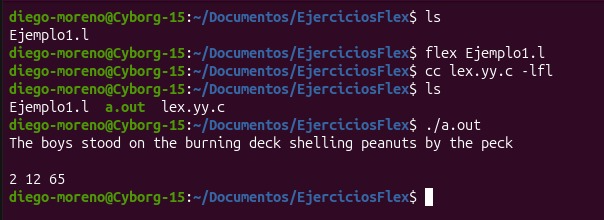
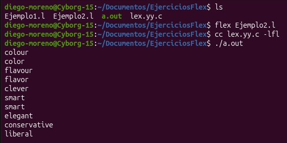
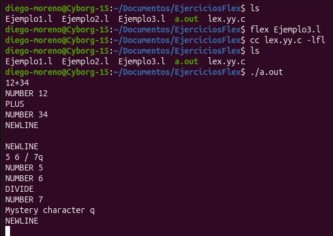
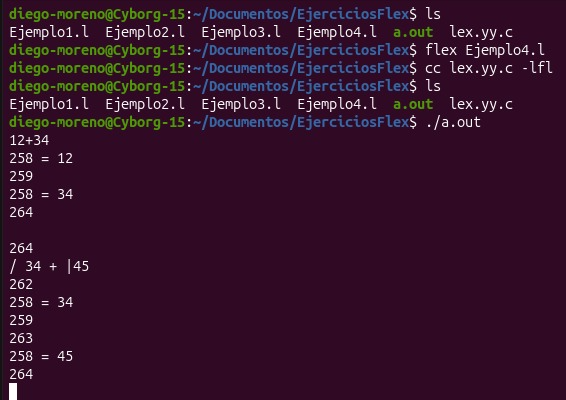
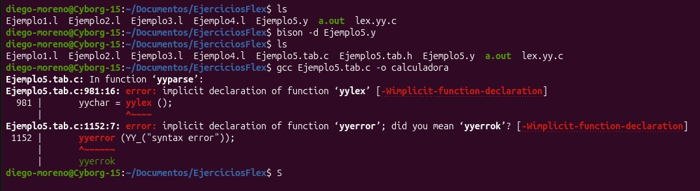
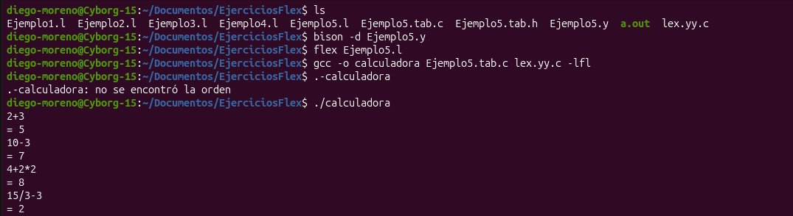

# Ejercicios de Flex y Bison


## Ejemplo 1 — Contador de líneas, palabras y caracteres

**Archivo:** `Ejemplo1.l`

Analizador léxico básico que cuenta cuántas líneas, palabras y caracteres tiene el texto de entrada, de forma similar al comando `wc`. Reconoce tres tipos de patrones:

- `[a-zA-Z]+`: una secuencia de letras se cuenta como una palabra, y se suman sus caracteres.
- `\n`: un salto de línea incrementa el contador de líneas y de caracteres.
- `.`: cualquier otro carácter simplemente se cuenta.

Al finalizar la entrada (con `Ctrl+D`), el programa imprime los tres contadores.

### Compilación y ejecución

```bash
flex Ejemplo1.l
cc lex.yy.c -o a.out -lfl
./a.out
```

### Captura de ejecución




---

## Ejemplo 2 — Traductor inglés británico a inglés americano

**Archivo:** `Ejemplo2.l`

Este ejercicio muestra cómo usar Flex para hacer sustituciones de texto. Reconoce palabras específicas en inglés británico y las reemplaza por su equivalente en inglés americano:

### Compilación y ejecución

```bash
flex Ejemplo2.l
cc lex.yy.c -o a.out -lfl
./a.out
```

### Captura de ejecución



Se puede observar cómo cada palabra ingresada (`colour`, `flavour`, `clever`, `smart`, `elegant`, `conservative`) es reemplazada por su equivalente correspondiente.

---

## Ejemplo 3 — Reconocimiento de tokens de una calculadora

**Archivo:** `Ejemplo3.l`

Primer paso hacia la construcción de una calculadora: en lugar de evaluar expresiones, este analizador se limita a **reconocer e imprimir el nombre de cada token** que compone la expresión matemática:

- Operadores `+`, `-`, `*`, `/`, `|` (valor absoluto) → `PLUS`, `MINUS`, `TIMES`, `DIVIDE`, `ABS`.
- Números (`[0-9]+`) → `NUMBER <valor>`.
- Saltos de línea → `NEWLINE`.
- Espacios y tabulaciones se ignoran.
- Cualquier otro carácter se reporta como `Mystery character`.

### Compilación y ejecución

```bash
flex Ejemplo3.l
cc lex.yy.c -o a.out -lfl
./a.out
```

### Captura de ejecución



---

## Ejemplo 4 — Tokens con códigos numéricos (previo a Bison)

**Archivo:** `Ejemplo4.l`

Se definen los tokens como constantes numéricas mediante un `enum` (`NUMBER = 258`, `ADD = 259`, `SUB = 260`, `MUL = 261`, `DIV = 262`, `ABS = 263`, `EOL = 264`), tal como los manejaría internamente un parser generado por Bison. El valor de los números se guarda en la variable global `yylval`.

La función `main` llama repetidamente a `yylex()` e imprime el código numérico de cada token; si el token es un `NUMBER`, también imprime su valor.

### Compilación y ejecución

```bash
flex Ejemplo4.l
cc lex.yy.c -o a.out -lfl
./a.out
```

### Captura de ejecución


---

## Ejemplo 5 — Calculadora completa con Flex + Bison

**Archivos:** `Ejemplo5.l`, `Ejemplo5.y` (y los generados `Ejemplo5.tab.c`, `Ejemplo5.tab.h`, `lex.yy.c`)


- `Ejemplo5.y` (gramática de Bison) define las reglas sintácticas: `calclist`, `exp`, `factor` y `term`, respetando la precedencia habitual de las operaciones aritméticas, y calcula el resultado de cada línea de entrada, imprimiéndolo con `= resultado`.
- `Ejemplo5.l` (analizador de Flex) ahora incluye el encabezado `Ejemplo5.tab.h` (generado por Bison) en lugar de definir los tokens manualmente, para que ambos programas compartan la misma definición de tokens.

### Proceso de compilación


```bash
bison -d Ejemplo5.y      # genera Ejemplo5.tab.c y Ejemplo5.tab.h
flex Ejemplo5.l           # genera lex.yy.c
gcc -o calculadora Ejemplo5.tab.c lex.yy.c -lfl
./calculadora
```

### Captura 1: error por archivo Flex faltante



En esta primera captura se ejecuta `gcc Ejemplo5.tab.c -o calculadora` **sin haber generado antes `lex.yy.c` con `flex`**. Al faltar la implementación de `yylex()` y `yyerror()` (que en este flujo de trabajo se espera que provengan del analizador léxico), el compilador arroja los errores:

```
Ejemplo5.tab.c: In function ‘yyparse’:
Ejemplo5.tab.c:981:16: error: implicit declaration of function ‘yylex’
Ejemplo5.tab.c:1152:7: error: implicit declaration of function ‘yyerror’; did you mean ‘yyerrok’?
```

Esto ocurre porque el paso `flex Ejemplo5.l` (que genera `lex.yy.c` con la definición de `yylex`) fue omitido antes de compilar.

### Captura 2: compilación y ejecución correctas




Los resultados confirman que la calculadora respeta correctamente la precedencia de operadores (por ejemplo, `4+2*2 = 8` y no `12`, ya que la multiplicación se resuelve antes que la suma).

---

## Integrantes del Grupo:
Carol Arenas 
Samuel Merchan
Diego Moreno

